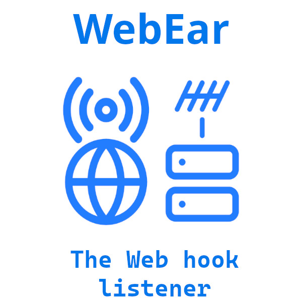

# WebEar

[](LICENSE)



## Description

WebEar is a simple Web hook listener written in Go. All it does is keep listening
for incoming POST requests and execute a shell script you have pre-configured for
received web hook trigger.

## Table of Contents

- [Installation](#installation)
- [Usage](#usage)
- [Features](#features)
- [Contributing](#contributing)
- [License](#license)
- [Contact](#contact)

## Installation

For now, I do not have prebuilt binaries and therefore specific installation
instructions. You can build the project yourself. This is nothing but a plain
go project. Clone this repo, build the project.

You need to have `make` to build the project. If you don't want to install `make`,
then you can read the `Makefile` and run the commands manually. Shoudn't be more
than 5 shell commands.

Once built, output goes to `./dist` directory. There you find the `install.sh`
script and `uninstall.sh` script, and of cause the binary `webear`. Run the
intallation script as `root`

**NOTE**: Installation script has a part which creates a SELinux Context for the
binary. If not applicable for your situation, you may remove (or comment out) that
part from the installation script.

Comment out the following part.

```shell
# Set correct SELinux context
echo_step "Configuring SELinux..."
if command -v semanage &> /dev/null; then
    semanage fcontext -a -t bin_t "${BINARY_PATH}"
    restorecon -v "${BINARY_PATH}"
else
    echo_error "SELinux tools not found. Please install policycoreutils-python-utils"
    exit 1
fi
```

## Usage

A proper installation with the `install.sh` script should create a systemd service,
already enabled and started. Therefore, by that point, `WebEar` should be running on
port `8080` and listening for incoming POST requests.

To make `WebEar` do something useful, you need to create a configuration file. Create
`/etc/webear/config.toml` file with the following content:

```toml
[listener.listener-name]
secret = "some-secret"
user = "user-account-name" # Script will be executed as this user
script = "/absolute/path/to/your/script.sh"
```

You can create as much as listeners you want. Just make sure to replace `listener-name`
with a unique name for each listener. The `secret` is the secret key you expect to
receive in the POST request. The `user` is the user account under which the script
is executed. The `script` is the absolute path to the script you want to execute.
For security reasons, `script` must be an absolute path. When some outside service trying
to trigger a web hook, it must send the secret key in the POST request as JSON. Program
will only check for string equality. This is to prevent spam requests triggering your
script.

Once you have the configuration file, you need to restart the `WebEar` service.

```shell
sudo systemctl restart webear.service
```

The post request should be in the following format.

`/listener-name`

Body should be a JSON object with following keys.

```json
{
	"secret": "some-secret",
	"idempotent_key": "a4d915937591",
	"data": "An optional string data field"
}
```

When the script is executing, it will receive `data` and web hook name in the
environment variables, `WEBEAR_DATA` and `WEBEAR_NAME` respectively. Idempotent key
is some kind of unique value for each request. In case your external service calls
the web hook multiple times for the same reason, idempotent key prevents re-execution.

When WebEar calls your script, it will receive no envirnoment variables other than
the following.

- `WEBEAR_DATA`
- `WEBEAR_NAME`
- `HOME`
- `USER`

That's all. Not even `PATH`. Therefore, when writing your script, initialize the PATH
and other necessary environment variables at the beginning.

## Contributing

Guidelines for contributing to your project.

## License

This project is licensed under the [MIT License](LICENSE).

This is my personal project, but mainly developed for internal use of project in
our startup, Kneoxt. I will keep using my copy. I don't care what you do with your
copy of the source code. At minimum, you might want to change the default port. So
change the code, copy the code, do whatever MIT license allows you to do.